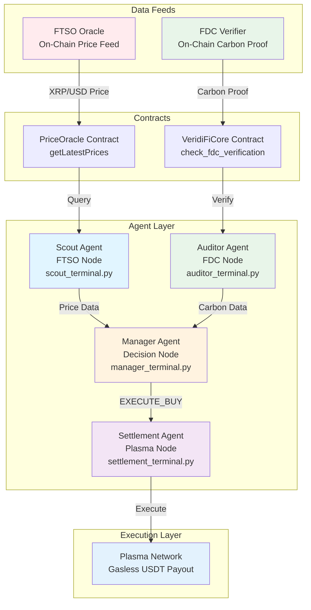

# Developer Green Treasury - Agent Interaction Diagram

## Mermaid Diagram



## ASCII Flow Diagram

```
┌─────────────────────────────────────────────────────────────────────┐
│                    DEVELOPER GREEN TREASURY                         │
│                      Agent Interaction Flow                          │
└─────────────────────────────────────────────────────────────────────┘

┌─────────────────┐                    ┌─────────────────┐
│   FTSO Oracle   │                    │  FDC Verifier   │
│  (On-Chain)     │                    │   (On-Chain)     │
└────────┬────────┘                    └────────┬────────┘
         │                                      │
         │ XRP/USD Price                       │ Carbon Proof
         │                                      │
         ▼                                      ▼
┌─────────────────┐                    ┌─────────────────┐
│ PriceOracle     │                    │ VeridiFiCore    │
│ Contract        │                    │ Contract        │
│                 │                    │                 │
│ getLatestPrices │                    │ check_fdc_      │
│                 │                    │ verification    │
└────────┬────────┘                    └────────┬────────┘
         │                                      │
         │ Query                                │ Verify
         │                                      │
         ▼                                      ▼
┌─────────────────┐                    ┌─────────────────┐
│  SCOUT AGENT    │                    │ AUDITOR AGENT   │
│  (FTSO Node)    │                    │  (FDC Node)     │
├─────────────────┤                    ├─────────────────┤
│ Terminal:       │                    │ Terminal:       │
│ scout_terminal  │                    │ auditor_terminal│
│                 │                    │                 │
│ Output:         │                    │ Output:         │
│ • XRP Price     │                    │ • Carbon Int.   │
│ • Timestamp     │                    │ • FDC Status    │
│ • Freshness     │                    │ • Round ID      │
└────────┬────────┘                    └────────┬────────┘
         │                                      │
         │ Price Data                           │ Carbon Data
         │                                      │
         └──────────────┬───────────────────────┘
                        │
                        ▼
              ┌───────────────────┐
              │  MANAGER AGENT     │
              │  (Decision Node)   │
              ├───────────────────┤
              │ Terminal:          │
              │ manager_terminal   │
              │                    │
              │ Decision Logic:    │
              │ ┌───────────────┐  │
              │ │ IF price <    │  │
              │ │    $1.10 AND  │  │
              │ │ carbon < 50   │  │
              │ │ THEN EXECUTE  │  │
              │ └───────────────┘  │
              │                    │
              │ Output:            │
              │ • EXECUTE_BUY     │
              │ • WAIT            │
              │ • HALT_ACTIVITY   │
              └─────────┬─────────┘
                        │
                        │ EXECUTE_BUY Signal
                        │
                        ▼
              ┌───────────────────┐
              │ SETTLEMENT AGENT  │
              │  (Plasma Node)     │
              ├───────────────────┤
              │ Terminal:          │
              │ settlement_terminal│
              │                    │
              │ Script:            │
              │ plasma_settlement │
              │ .ts               │
              └─────────┬─────────┘
                        │
                        │ Plasma Payout
                        │
                        ▼
              ┌───────────────────┐
              │  PLASMA NETWORK   │
              │  (Gasless USDT)   │
              │                    │
              │ Output:            │
              │ • TX Hash         │
              │ • Gas Fee: $0.00   │
              └───────────────────┘
```

## Decision Flow

```
                    ┌─────────────┐
                    │   START     │
                    └──────┬──────┘
                           │
                           ▼
                    ┌─────────────┐
                    │ Scout Agent │
                    │ Query FTSO  │
                    └──────┬──────┘
                           │
                           ▼
                    ┌─────────────┐
                    │Auditor Agent│
                    │ Check FDC   │
                    └──────┬──────┘
                           │
                           ▼
                    ┌─────────────┐
                    │Manager Agent│
                    │  Evaluate   │
                    └──────┬──────┘
                           │
            ┌──────────────┼──────────────┐
            │              │              │
            ▼              ▼              ▼
    ┌───────────┐  ┌───────────┐  ┌───────────┐
    │EXECUTE_BUY│  │   WAIT    │  │   HALT    │
    └─────┬─────┘  └───────────┘  └───────────┘
          │
          ▼
    ┌─────────────┐
    │Settlement   │
    │   Agent     │
    │ Plasma Payout│
    └─────────────┘
```

## Data Flow Sequence

```
Time →
│
├─→ [T0] Scout Agent queries PriceOracle.getLatestPrices()
│   └─→ Returns: {xrp_price: 1.05, timestamp: 1234567890}
│
├─→ [T1] Auditor Agent queries VeridiFiCore.check_fdc_verification()
│   └─→ Returns: {verified: true, intensity: 45, round_id: 42}
│
├─→ [T2] Manager Agent evaluates:
│   ├─→ Price: $1.05 < $1.10 ✅
│   ├─→ Carbon: 45 < 50 ✅
│   └─→ Decision: EXECUTE_BUY
│
└─→ [T3] Settlement Agent executes plasma_settlement.ts
    └─→ Returns: {tx_hash: "0x...", status: "COMPLETED"}
```

## Feed Connection Details

### Scout Agent → FTSO Feed
```
Scout Terminal
    │
    ├─→ contract_interface.get_latest_prices()
    │       │
    │       └─→ PriceOracle.getLatestPrices()
    │               │
    │               └─→ FTSO Oracle (On-Chain)
    │                       │
    │                       └─→ XRP/USD Feed ID: 0x015852502f555344...
    │
    └─→ Output: {xrp_price, timestamp, freshness}
```

### Auditor Agent → FDC Feed
```
Auditor Terminal
    │
    ├─→ contract_interface.check_fdc_verification()
    │       │
    │       ├─→ VeridiFiCore.latestRoundId()
    │       ├─→ VeridiFiCore.getCarbonIntensity(roundId)
    │       │       │
    │       │       └─→ FDC Verification (On-Chain)
    │       │               │
    │       │               └─→ Flare Consensus Network
    │       │
    │       └─→ Output: {verified, intensity, round_id, is_low_carbon}
    │
    └─→ Validation: intensity < 50 gCO2/kWh
```

### Manager Agent → Decision Logic
```
Manager Terminal
    │
    ├─→ Receives: {xrp_price} from Scout
    ├─→ Receives: {intensity, verified} from Auditor
    │
    ├─→ Decision Logic:
    │   ├─→ IF (price < $1.10) AND (carbon < 50 AND verified)
    │   │   └─→ EXECUTE_BUY
    │   ├─→ IF (carbon >= 150)
    │   │   └─→ HALT_ACTIVITY
    │   └─→ ELSE
    │       └─→ WAIT
    │
    └─→ Output: {decision, reason, price_eval, carbon_eval}
```

### Settlement Agent → Plasma Feed
```
Settlement Terminal
    │
    ├─→ Executes: plasma_settlement.ts
    │       │
    │       ├─→ Plasma Paymaster Helper
    │       │       │
    │       │       └─→ Plasma Network (Testnet)
    │       │
    │       └─→ USDT Transfer (Gasless)
    │
    └─→ Output: {tx_hash, status, amount, gas_fee: $0.00}
```


